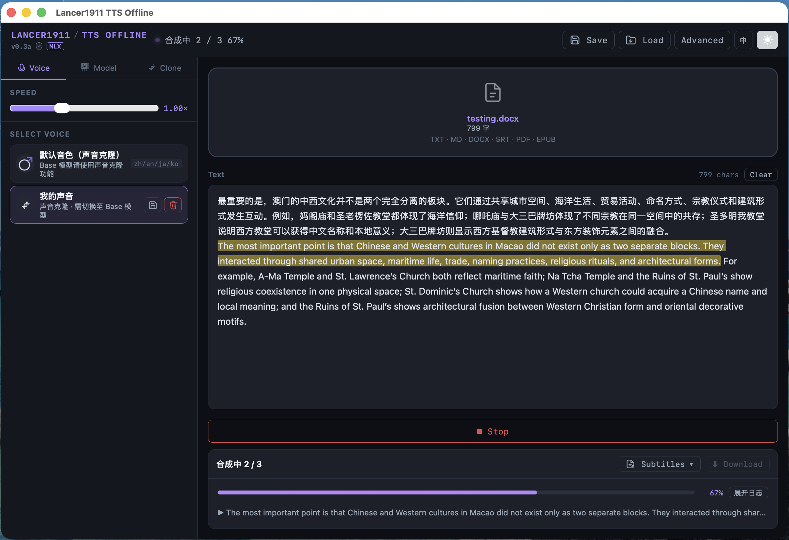
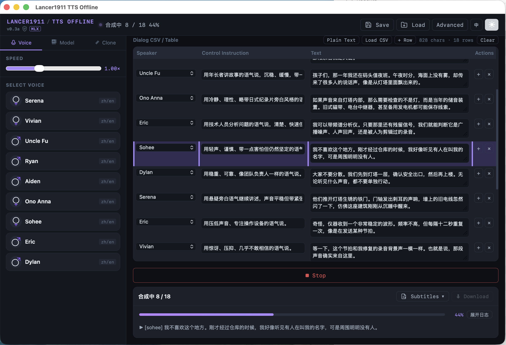
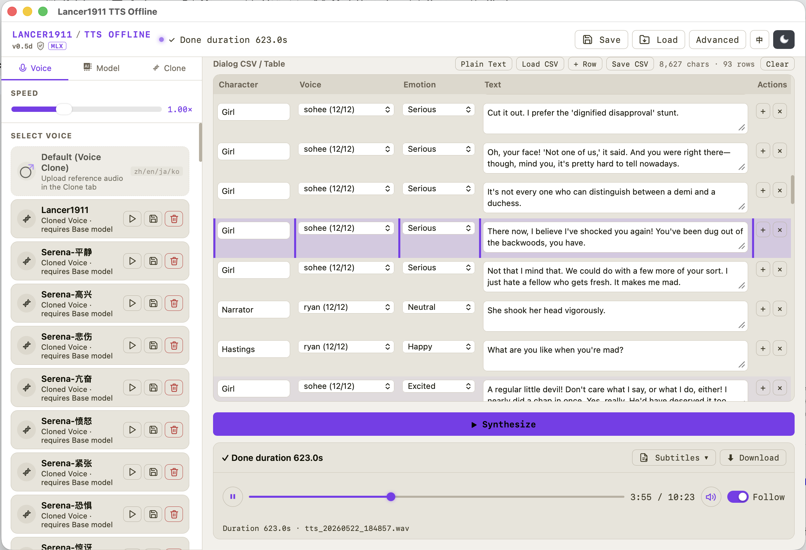
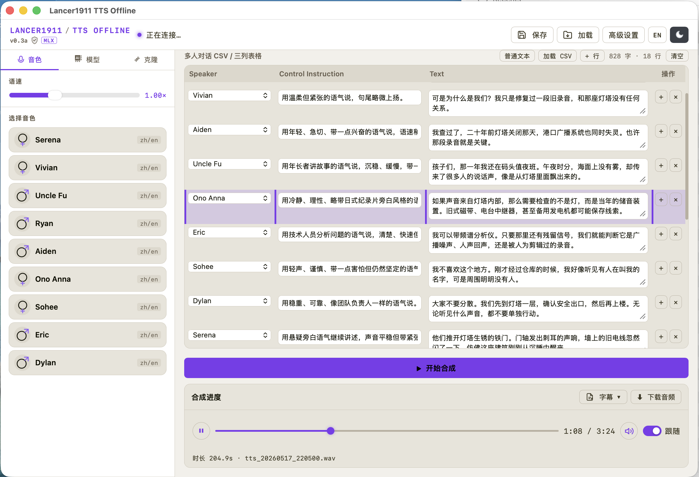
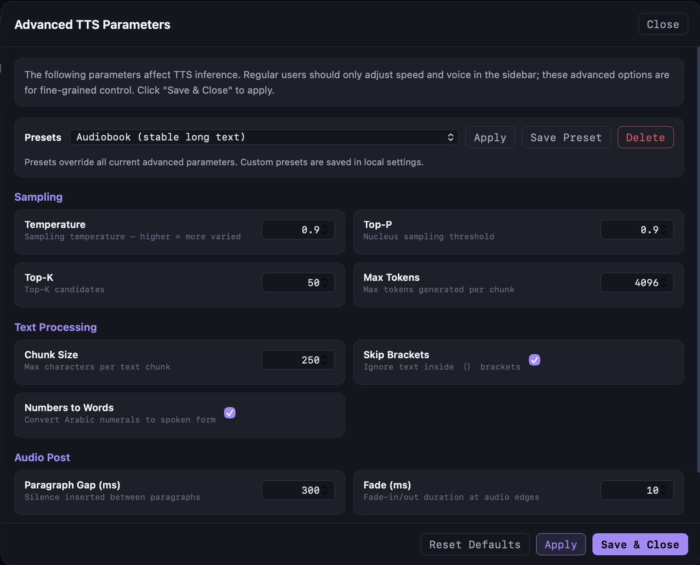
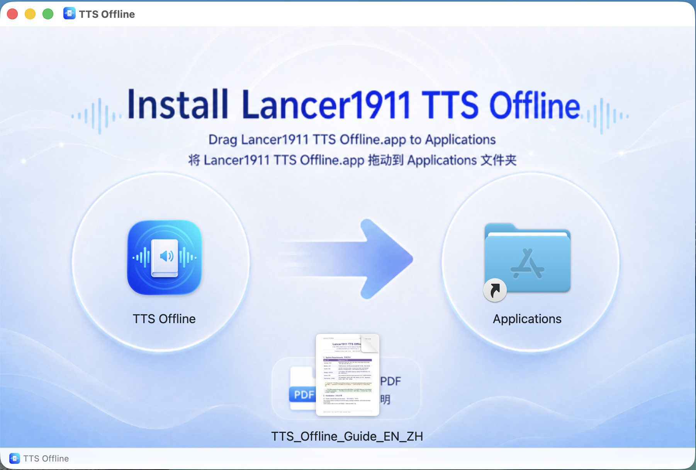

🌐 [English](README.md)

# Lancer1911 TTS Offline

> 完全离线的多角色、情绪可控文本转语音合成工具  
> 专为 Apple Silicon 设计 — 适合有声书制作、多人对话剧本、旁白配音与长文本本地批量合成


---

## 🎬 演示视频

<p align="center">
  <video controls width="800">
    <source src="https://lancer1911.github.io/videos/lancer1911-tts-offline.mp4" type="video/mp4">
    您的浏览器不支持 video 标签。
  </video>
  <br>
  <em>TTS-Offline 演示 — 本地文本转语音、多角色对话与有声书制作流程</em>
  <br>
  <a href="https://lancer1911.github.io/videos/lancer1911-tts-offline.mp4">
    ▶ 打开演示视频
  </a>
</p>

---

## ⚠️ 硬件要求

Lancer1911 TTS Offline 通过 MLX 框架在本机运行 Qwen3-TTS。合成过程完全离线，但模型权重、KV 缓存和中间音频数据都需要放入本机统一内存。

|  | 最低配置 | 推荐配置 |
|---|---|---|
| **芯片** | Apple M1 | M2 Pro / M3 / M4 或更新 |
| **统一内存** | **16 GB** | **32 GB** |
| **存储空间** | 5 GB 可用 | 15 GB 可用（多模型） |
| **macOS 版本** | 13 Ventura | 14 Sonoma 或更新 |

> **为什么 16 GB 就够？** 默认模型 `Qwen3-TTS-12Hz-1.7B-CustomVoice-8bit` 权重约 1.7 GB。运行时 MLX 还会分配 KV 缓存、音频缓冲、输出 WAV 数据以及 pywebview / FastAPI 的内存。16 GB 设备可以流畅处理大多数合成任务。轻量 0.6B 版本内存占用更低。声音克隆会额外占用参考音频 embedding 的小量内存。超长文档或包含大量发言人的对话表格可能需要更多余量。

---

## 界面截图

<p align="center">
  
  <br><em>主界面</em>
</p>
<p align="center">
  
  <br><em>对话表格模式</em>
</p>
<p align="center">
  
  <br><em>Base 模式 CSV 对话录制 — 四列脚本（人物 / 音色 / 情绪 / 文字内容），使用克隆与锚定音色进行多角色有声书制作</em>
</p>

### 🎧 样本：《高尔夫球场谋杀案》第一章（Base 模式，多角色）

以下样本完全使用 Base 模式，通过四列 CSV 剧本生成。每个角色由独立的克隆或锚定音色演绎，逐行指定情绪指令。

<p align="center">
  <audio controls style="width:680px">
    <source src="samples/sample-Murder_on_the_Links_Ch1.m4a" type="audio/mp4">
    您的浏览器不支持 audio 标签。
    <a href="samples/sample-Murder_on_the_Links_Ch1.m4a">⬇ 下载样本音频</a>
  </audio>
  <br>
  <a href="samples/sample-Murder_on_the_Links_Ch1.csv">📄 查看 CSV 剧本</a>
</p>

<p align="center">
  
  <br><em>回放模式</em>
</p>
<p align="center">
  
  <br><em>高级设置</em>
</p>
<p align="center">
  
  <br><em>macOS安装界面</em>
</p>

---

## 能做什么？

Lancer1911 TTS Offline 不只是一个 TTS 转换工具。其**对话表格模式**支持**逐句、多角色、逐情绪**地制作长篇音频——这正是大多数商业 TTS 平台收取高额费用才能提供的能力：

- 为每一行对话分配不同的**音色**
- 为每一行提供自由格式的**情绪 / 导演指令**（如"低沉而略带不安"、"轻快但克制"、"威严且语速缓慢"）
- 将剧本以 **CSV** 格式导入，一键合成完整有声书或广播剧，并导出带逐段时间戳的 SRT / JSON
- **点击播放时间轴上的任意段落**跳转到精确位置，或**点击文本中的任意句子**定位播放器
- **跟随模式**在播放时自动高亮当前句子；**反向跟随**支持双向定位
- 将整个会话（剧本 + 音色 + 设置 + 时间戳）保存为 `.ttso` 文件，随时恢复

该工具特别适合：

| 使用场景 | 说明 |
|---|---|
| 有声书制作 | 完整多角色配音，逐句控制节奏和情绪 |
| 广播剧 / 播客剧本 | 每位角色独立音色，附加导演说明 |
| 旁白与角色混合 | 旁白音色与角色音色在同一个流程中混合合成 |
| 长篇内容创作 | 在单个会话中处理完整书籍或剧本 |
| 音色原型测试 | 在正式录音前测试不同音色与情绪的实际效果 |

---

## 最近更新（v0.5w）

相较早期 README 版本，当前版本已显著增强长文本、多角色与英文 Base 模式的稳定性：

- **坏音频自动检测与修复**：针对低频啸叫、拖尾、异常时长、峰值和 ZCR 等情况进行检测；失败片段会自动重试，并逐步按句子、短语、词组甚至更小单元重新切分生成。
- **Base 模式英文稳定性优化**：英文合成改用更合理的词数/时长估算，缩短英文 chunk，收紧采样参数，并针对克隆音色英文长尾问题提供保护性裁切与快速失败机制。
- **克隆音色持久化**：克隆音色与锚定音色独立保存到 `~/.tts_offline_clone_voices/init.json`，重启后可自动恢复，避免反复导入或等待模型 worker 注册。
- **Python 侧麦克风录音**：克隆页可直接调用系统麦克风录制参考音频，绕过 WKWebView 对 `navigator.mediaDevices` 的限制，并支持设备选择和最长 30 秒录音。
- **四列 CSV 对话脚本**：Base 模式支持“人物 / 音色 / 情绪 / 文本”四列结构，适合稳定制作多人有声书、广播剧和长篇对话。
- **角色锚定音色**：可从 CustomVoice / VoiceDesign 生成可复用锚点；支持中文锚点与可选英文锚点，并可导入 / 导出 `.ttscx` 锚定包。
- **英文锚点直接生成**：英文锚点现在直接调用对应原始人物音色和情绪生成，不再全部从同一句 neutral 样本派生，因此不同人物和不同情绪更容易保持差异。
- **Base CSV 自动语言匹配**：Base 模式 CSV 合成时，英文文本会优先使用同一人物 / 情绪的 `- English` 锚点；不存在时再回退到 `- Chinese` 或其他同源音色。
- **SRT 时间轴合成**：导入 SRT 时可按原始字幕时间轴插入静音；如果合成音频超过下一条字幕时间，不截断内容，而是继续顺序合成并提示用户调整语速。
- **更严格的文件入口**：主文本上传入口仅允许 TXT / MD / DOCX / SRT / PDF / EPUB；CSV 仅通过 Dialog Table 的 Load CSV 导入；克隆 / 锚定包入口仅处理对应格式。

## 功能特性

- **完全离线** — 合成在本机 MLX 上运行，文本和音频不会离开你的 Mac。
- **9 种内置音色** — Serena、Vivian、Uncle Fu、Ryan、Alden、Ono Anna、Sohee、Eric、Dylan，涵盖多种性别、口音与风格。
- **CustomVoice / Base / VoiceDesign 模型族** — 支持内置音色、参考音频克隆、角色锚定和实验性音色设计流程。
- **声音克隆** — 上传或录制 5–30 秒参考音频，Base 模型可生成对应克隆音色；普通克隆现在默认生成 `- Chinese` 卡片，并尝试派生 `- English` 卡片。
- **Python 侧麦克风录音** — 克隆页可选择麦克风设备并直接录制参考音频，适用于打包后的 macOS app。
- **角色锚定音色** — 使用当前 CustomVoice / VoiceDesign 生成稳定样本并保存为 Base 模式可复用锚点；支持批量锚定、中文锚点、可选英文锚点，以及 `.ttscx` 导入 / 导出。
- **英文锚点差异化生成** — 英文锚点按不同人物和 12 种情绪分别生成，避免所有英文锚点听起来相同。
- **四列对话表格模式** — 支持“人物 / 音色 / 情绪 / 文本”CSV；人物用于绑定角色，音色用于指定实际合成音色，情绪用于逐行导演控制。
- **Base CSV 自动语言匹配** — 英文文本优先匹配同一人物 / 情绪的 `- English` 锚点；中文和日文等文本优先使用 `- Chinese` 锚点。
- **普通文本模式** — 粘贴或上传文本，进行单音色合成，自动分段处理长文本。
- **多格式输入支持** — TXT、Markdown、DOCX、SRT、PDF、EPUB；主上传入口会过滤掉 CSV、JSON、PPTX、TTSCX 等不适用格式。
- **SRT 时间轴合成** — 可按 SRT 原始时间戳插入静音并保留字幕节奏；若合成音频超出原时间轴，不截断内容。
- **坏音频检测与自动修复** — 对低频啸叫、异常拖尾、截断和失败 chunk 进行检测、重试、渐进切分和必要时静音替换。
- **WAV 和 MP3 输出** — 选择输出格式；MP3 需要系统安装 ffmpeg。
- **逐段时间戳** — 每个合成分段均带有最终音频中的起止时间，可导出为 SRT、TXT、Markdown、JSON 或 CSV。
- **双向跟随播放** — 合成完成后可播放。跟随模式高亮当前句子；反向跟随允许点击任意句子或对话行定位播放器。
- **会话文件（.ttso）** — 保存和恢复完整状态：剧本、音色选择、设置、时间戳和音频回放状态。
- **高级 TTS 参数** — Temperature、Top-P、Top-K、最大 token、分段字数、段落静音、淡入淡出时长和音调偏移，均可通过高级设置面板调节，并支持内置与自定义 preset。
- **实时日志面板** — 展开日志后可查看 chunk、坏音频检测、重试、修复、模型 worker 输出等诊断信息。
- **模型选择器** — 在 CustomVoice、Base 和 VoiceDesign 模型族之间切换；界面自动检测本地已安装的模型。
- **字幕导出** — 支持 SRT、TXT、Markdown、JSON、Excel 兼容 CSV。
- **双语界面** — 顶栏语言按钮可在中文和英文 UI 之间切换。
- **深色 / 浅色主题** — 顶栏主题按钮可切换外观。

---

## 快速开始

### 1. 克隆或解压项目

```bash
git clone https://github.com/lancer1911/TTS-Offline.git
cd TTS-Offline
```

如果使用压缩包版本，解压后进入项目目录即可。

### 2. 安装系统依赖

```bash
brew install ffmpeg
```

MP3 输出需要 ffmpeg；WAV 输出无需额外依赖。

### 3. 创建运行环境

```bash
python3 -m venv ~/tts-offline-env
source ~/tts-offline-env/bin/activate
pip install --upgrade pip setuptools wheel
pip install -r requirements.txt
```

### 4. 下载 TTS 模型

所有模型来自 HuggingFace 的 `mlx-community` 组织，使用 `hf download` 下载（需要 `huggingface_hub`）：

```bash
# 默认推荐 — 9 种内置音色，支持情绪指令
hf download mlx-community/Qwen3-TTS-12Hz-1.7B-CustomVoice-8bit

# 轻量版 — 速度更快，内存占用更低
# hf download mlx-community/Qwen3-TTS-12Hz-0.6B-CustomVoice-8bit

# 声音克隆用 — 无内置音色，需提供参考音频
# hf download mlx-community/Qwen3-TTS-12Hz-1.7B-Base-8bit
```

> **中国用户：** 在命令前加 `HF_ENDPOINT=https://hf-mirror.com` 使用镜像站：
> ```bash
> HF_ENDPOINT=https://hf-mirror.com hf download mlx-community/Qwen3-TTS-12Hz-1.7B-CustomVoice-8bit
> ```

模型下载后缓存在 `~/.cache/huggingface/hub/`，离线状态下可继续使用。

> 如果提示找不到 `hf` 命令：`pip install -U huggingface_hub`

### 5. 启动

```bash
source ~/tts-offline-env/bin/activate
python main.py
```

应用会启动本地 FastAPI 服务，并通过 pywebview 打开桌面窗口，默认地址：

```
http://127.0.0.1:17435
```

首次启动需要将模型加载到内存，可能需要 10–30 秒。状态栏显示"就绪"后即可开始合成。

---

## 基本使用流程

### 普通文本合成

1. 在左侧**音色**标签页选择音色。
2. 在主编辑框粘贴或输入文本，也可以拖放 TXT / MD / DOCX / SRT / PDF / EPUB 文件。
3. 使用侧边栏滑块调整语速。
4. 点击 **▶ 开始合成**。
5. 合成完成后，播放栏出现。点击**⬇ 下载音频**保存。

### 多角色有声书（四列对话表格）

1. 点击**对话表格**切换到表格视图。
2. 每一行代表一段语音。当前推荐使用四列结构：
   - **人物 / Character** — 用于绑定角色身份，例如 `Narrator`、`Ye Wenjie`、`Poirot`。
   - **音色 / Voice** — 实际用于合成的音色，可为内置音色、克隆音色或锚定音色。
   - **情绪 / Emotion** — 可选的情绪或导演说明，例如“悲伤且缓慢”“低声耳语”“happy”“angry”。
   - **文本 / Text** — 需要合成的台词。

3. 点击 **+ 行** 添加行，或点击**加载 CSV** 导入剧本。

   推荐 CSV 格式（表头可选）：
   ```csv
   Character,Voice,Emotion,Text
   Narrator,Uncle Fu,calm,从前，在一个宁静的小村庄里……
   Ryan,Ryan,whispering,我们必须离开，现在。
   Vivian,Vivian,warm,一切都会好的。
   ```

4. 点击 **▶ 开始合成**，各行按顺序合成并拼接为单个音频文件，同时生成逐段时间戳。
5. 合成后，点击任意行跳转到对应播放位置（**反向跟随**）；开启**跟随**可在播放时自动滚动并高亮当前行。
6. 在 Base 模式下，如果同一角色存在 `- English` / `- Chinese` 锚定音色，程序会根据当前行文本语言自动优先选择更合适的锚点。

### SRT 时间轴合成

1. 从主上传入口选择 `.srt` 文件。
2. 程序会读取每条字幕的开始时间，并在需要时自动插入静音，以保留原始时间轴。
3. 如果某条合成音频长于原字幕间隔，程序不会截断音频，而是继续顺序合成；如果后续重新追上时间轴，再继续插入静音对齐。
4. 如果整体明显超时，合成完成后会提示用户调高语速、缩短文本或重新调整字幕。

### 声音克隆与角色锚定

#### 声音克隆

1. 进入**克隆**标签页。
2. 输入**克隆名称**。参考文本通常可以留空，特别是参考音频本身已经清晰时。
3. 上传 WAV / MP3 参考文件，或点击麦克风按钮录制 5–30 秒参考音频。
4. 点击**开始克隆**。程序会保存中文克隆卡片，默认命名为 `名称 - Chinese`，并可根据当前逻辑派生 `名称 - English` 卡片。
5. 克隆完成的音色会保存到本地，重启后自动恢复。

> 声音克隆需要 **Base 模型**（如 `Qwen3-TTS-12Hz-1.7B-Base-8bit`）。请先在**模型**标签页切换到 Base 模型并加载后再使用克隆功能。

#### 角色锚定

1. 切换到 CustomVoice 或 VoiceDesign 模型，选择一个原始人物音色和情绪。
2. 使用**角色锚定**生成稳定样本并保存为 Base 模式可复用音色。
3. 默认生成 `- Chinese` 锚点；勾选“同时制作英文锚定音色”时，会额外生成 `- English` 锚点。
4. 批量锚定同样可读取该复选框；适合一次性为多个人物和多种情绪生成有声书制作素材。
5. 可通过**导出锚定包 / 导入锚定包**在不同机器或项目之间迁移 `.ttscx` 锚定音色。

## 内置音色参考

| 音色 | 性别 | 语言 | 风格 |
|---|---|---|---|
| Serena | 女 | 中/英 | 温暖、专业 |
| Vivian | 女 | 中/英 | 明快、富有表现力 |
| Uncle Fu | 男 | 中/英 | 低沉、威严 |
| Ryan | 男 | 中/英 | 沉稳、清晰 |
| Alden | 男 | 中/英 | 随意、对话感 |
| Ono Anna | 女 | 中/英 | 温柔、从容 |
| Sohee | 女 | 中/英 | 活力、青春 |
| Eric | 男 | 中/英 | 中性、多用途 |
| Dylan | 男 | 中/英 | 醇厚、叙事感 |

所有内置音色均支持中文和英文，并响应情绪 / 风格指令。

---

## 情绪与风格指令

**指令**字段接受自由格式的自然语言，模型会将其解释为发言人的导演说明。示例：

| 指令 | 效果 |
|---|---|
| `语速缓慢而清晰` | 有节奏感，发音清晰 |
| `低声耳语，紧张` | 轻声但带有张力 |
| `轻快活泼` | 语速稍快，情绪明亮 |
| `平静但略带担忧` | 克制的情感，底色有忧虑 |
| `威严、正式` | 从容、庄重的语气 |
| `兴奋，语速较快` | 能量感强，节奏快 |
| `忧郁，若有所失` | 缓慢、轻柔，有尾音 |
| `温暖的讲故事语气` | 放松的叙事腔调 |

在对话模式下，每行均可独立设置指令，实现整个制作的逐句情感控制。

---

## 会话文件（.ttso）

`.ttso` 是完整的会话格式，包含：

- 所有对话行（发言人、指令、文本）或普通文本内容
- 音色选择与语速设置
- 高级参数值
- 逐段时间戳（每个合成分段的起止时间，单位 ms）
- 输出音频路径

推荐目录结构：

```
ProjectFolder/
├── my_audiobook.ttso
└── my_audiobook.wav
```

加载 `.ttso` 时，应用会尝试在同目录自动找到原始音频并恢复播放。

---

## 设置说明

### 模型标签页

| 设置项 | 说明 |
|---|---|
| **选择模型** | 从本地已安装的 Qwen3-TTS 变体（CustomVoice / Base / VoiceDesign）中选择。本地缓存中不存在的版本显示为不可用。 |
| **加载模型** | 将选中的模型加载到内存。切换模型后需点击此按钮。 |
| **输出格式** | WAV（无依赖）或 MP3（需要 ffmpeg）。 |
| **输出目录** | 合成音频的保存位置，默认为 `~/Downloads`。 |

### 音色标签页

| 设置项 | 说明 |
|---|---|
| **语速** | 语速倍率（0.5×–2.0×），通过重采样在合成后应用。 |
| **选择音色** | 内置和已克隆音色的网格列表。选中的音色用于普通文本合成，也是新对话行的默认音色。 |

---

## 高级 TTS 参数

点击顶栏 **Advanced / 高级设置** 打开高级参数面板。

### 采样参数

| 参数 | 默认值 | 说明 |
|---|---:|---|
| `Temperature` | `0.9` | 采样随机性。降低可使输出更稳定；升高可增加表达变化。 |
| `Top-P` | `0.9` | 核采样概率阈值。 |
| `Top-K` | `50` | 候选 token 数量。 |
| `Max Tokens` | `4096` | 每分段最大生成 token 数，超长句子可适当调大。 |

### 文本处理

| 参数 | 默认值 | 说明 |
|---|---:|---|
| `分段字数` | `250` | 每个合成分段的最大字符数。过大可能影响超长句子的稳定性。 |
| `跳过括号注释` | `true` | 忽略（）括号内的文字（舞台说明、标注等）。 |
| `数字转中文` | `true` | 合成前将阿拉伯数字转换为中文读法。 |

### 音频后处理

| 参数 | 默认值 | 说明 |
|---|---:|---|
| `段落静音 (ms)` | `300` | 各合成分段之间插入的静音时长。 |
| `淡入淡出 (ms)` | `10` | 音频首尾的淡化时长。 |
| `音调偏移` | `0` | 音调调整（半音，0 = 原始音调）。 |

### 内置 Presets

| Preset | 适用场景 |
|---|---|
| Audiobook（稳定长文本） | 长文档、章节级合成、输出稳定性优先 |
| 有声书（沉稳） | 更深沉、从容的有声书节奏 |
| 播客（自然） | 对话感旁白，节奏自然多变 |
| 配音（快） | 短内容、配音、节奏较快的交付 |
| 朗读（慢清晰） | 发音清晰，适合教育内容 |

自定义 preset 保存在 `~/.tts_offline_settings.json`。

---

## 导出

点击**字幕**菜单可导出时间戳数据与音频：

| 格式 | 说明 |
|---|---|
| SRT | 标准字幕文件，可导入视频编辑器或媒体播放器 |
| TXT | 带时间戳的纯文本，便于阅读和比对 |
| Markdown | 适合 Obsidian、Notion、文档类工具 |
| JSON | 完整结构化数据：文本、发言人、start_ms、end_ms |
| Excel (CSV) | 制表符分隔格式，可导入电子表格 |

---

## 打包为 macOS .app

本项目采用轻量壳体设计。`.app` 包含项目代码和静态资源，但不内嵌 Python、MLX 或模型权重。启动时由外部 Python 环境运行后端。

### 1. 准备运行环境

```bash
python3 -m venv ~/tts-offline-env
source ~/tts-offline-env/bin/activate
pip install --upgrade pip setuptools wheel
pip install -r requirements.txt
```

### 2. 准备打包环境

```bash
python3 -m venv ~/tts-offline-build-env
source ~/tts-offline-build-env/bin/activate
pip install --upgrade pip setuptools wheel py2app
```

### 3. 打包

```bash
rm -rf build dist
python build_mac.py py2app
```

生成的应用位于：

```
dist/Lancer1911 TTS Offline.app
```

### 4. 首次启动 Gatekeeper 警告

如果 macOS 阻止应用运行：

```bash
xattr -cr "/Applications/Lancer1911 TTS Offline.app"
```

或者：右键点击 app → 打开 → 在对话框中再次点击"打开"。

应用日志位于：

```
~/Library/Logs/TTSOffline.log
```

---

## 常见问题

**状态栏一直显示"正在连接"。**  
模型正在加载到内存。等待状态栏变为"就绪"。首次加载根据模型大小和存储速度可能需要 20–60 秒。

**端口已被占用。**  
默认端口为 17435，检查方式：

```bash
lsof -i :17435
```

如需终止：

```bash
lsof -ti :17435 | xargs kill -9
```

**未检测到模型。**  
首次启动时应用会弹出下载向导，按提示使用 `hf download` 下载模型。如果提示找不到 `hf` 命令，先执行 `pip install -U huggingface_hub`。

**合成结果不稳定或被截断。**  
尝试降低 `Temperature`（如调至 0.7）和 `分段字数`（如调至 150）。超长句子也可以通过添加标点来引导自然的分段位置。

**声音克隆无效。**  
声音克隆需要 Base 模型。请在模型标签页切换到 `Qwen3-TTS-12Hz-1.7B-Base-8bit` 或 `0.6B-Base-8bit` 并加载后再进行克隆。

**MP3 输出失败。**  
安装 ffmpeg：`brew install ffmpeg`。WAV 输出无需任何额外依赖。

**CSV 导入对话表格失败。**  
请确保 CSV 使用 UTF-8 编码。推荐四列：Character / Voice / Emotion / Text；旧版三列（Speaker / Instruction / Text）仍可作为简单对话脚本使用，但 Base 模式多角色制作建议改用四列。

**会话加载后找不到音频。**  
将 `.ttso` 文件和 `.wav` / `.mp3` 输出文件放在同一目录，且保持原始文件名。应用会在加载时自动配对。

---

## 依赖项目

| 项目 | 用途 |
|---|---|
| [mlx-audio](https://github.com/Blaizzy/mlx-audio) | Qwen3-TTS MLX 推理后端 |
| [FastAPI](https://fastapi.tiangolo.com) | 本地后端 API 与 WebSocket 服务 |
| [uvicorn](https://www.uvicorn.org) | ASGI 服务器 |
| [pywebview](https://pywebview.flowrl.com) | macOS 桌面窗口 |
| [ffmpeg](https://ffmpeg.org) | MP3 编码与音频处理 |
| [Qwen3-TTS](https://huggingface.co/Qwen) | TTS 模型族（CustomVoice / Base / VoiceDesign） |
| [python-docx](https://python-docx.readthedocs.io) | DOCX 文本提取 |
| [pdfminer.six](https://pdfminer.six.readthedocs.io) | PDF 文本提取 |
| [numpy](https://numpy.org) | 音频数组处理 |
| [sounddevice](https://python-sounddevice.readthedocs.io) | Python 侧麦克风录音 |
| [PyObjC AVFoundation](https://pyobjc.readthedocs.io) | macOS 打包应用的麦克风权限触发 |

---

## 许可证

本项目采用 **Apache License 2.0** 许可。

你可以自由使用、复制、修改、分发本软件，并可将其用于商业项目或闭源产品，但应遵守 Apache License 2.0 的相关条款。

再分发本项目或其派生版本时，请保留版权声明、许可证文本以及 `NOTICE` 文件。若分发的是修改版本，请明确标明已作出修改。第三方依赖项目仍分别受其各自许可证约束。
